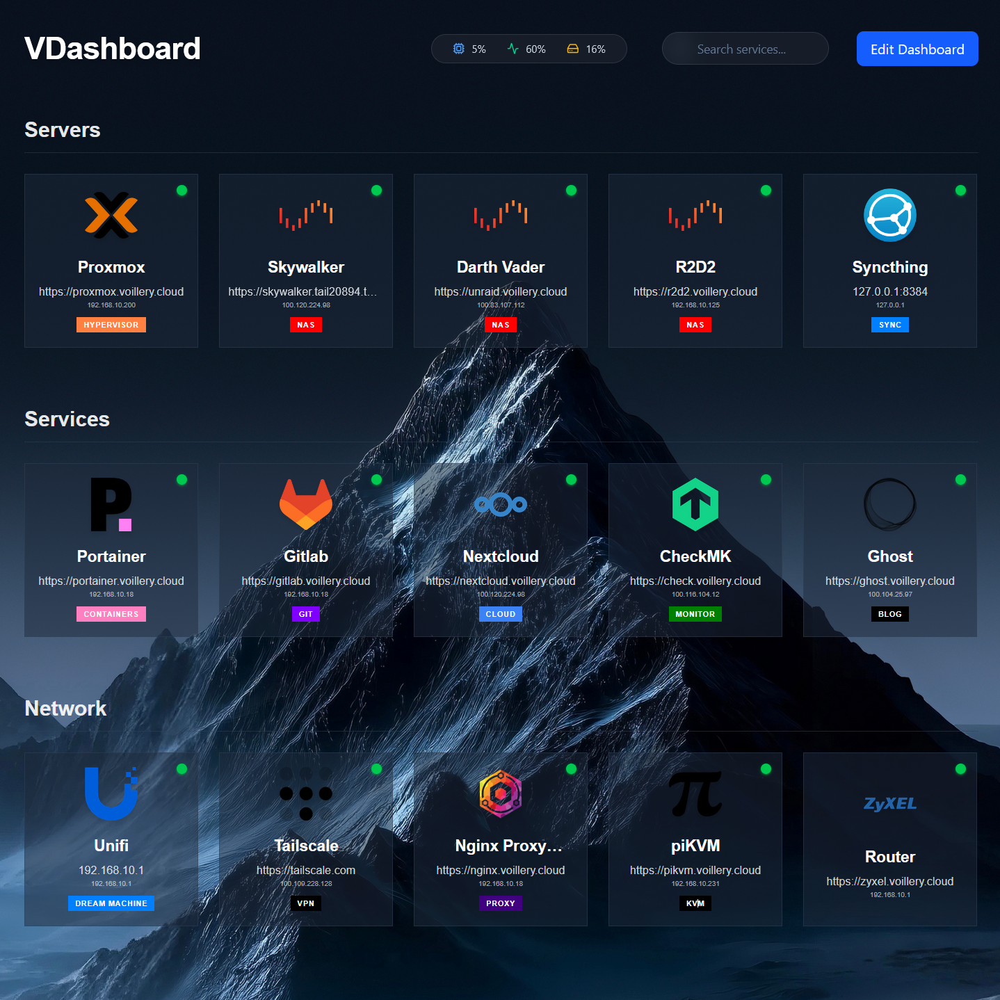

# VDashboard

A sleek, minimal, and highly customizable homelab dashboard for monitoring your local services and server health.



## ✨ Features

- **Service Monitoring:** Real-time status checks (online/offline) for your services via ICMP ping or TCP port checks.
- **System Stats:** Live monitoring of CPU load, Memory usage, and Disk space directly on the dashboard.
- **Deep Search:** A minimal, translucent search bar to quickly find services by name, URL, IP, or tags.
- **Customizable Tags:** Add colored tags to your service cards with flexible placement (corners, top, or bottom).
- **Sticky Notes:** Leave reminders for yourself with a translucent, "post-it" style note that you can customize and color.
- **Appearance Settings:** Complete control over:
  - Background images and scaling (Cover, Contain, Stretch, Auto).
  - Card dimensions, rounding, padding, and opacity.
  - Dashboard and Section header fonts, sizes, and colors.
  - Global tag styling and placement.
- **Mobile Friendly:** Fully responsive design that looks great on any screen.

## 🚀 Quick Start (Docker)

The easiest way to get VDashboard running is using Docker.

1. **Clone the repository:**
   ```bash
   git clone <your-repo-url>
   cd homelab-dashboard
   ```

2. **Start the dashboard:**
   ```bash
   docker compose up -d --build
   ```

3. **Access the dashboard:**
   Open your browser and navigate to `http://localhost:3001`.

## 🛠️ Manual Installation (Development)

If you prefer to run it without Docker:

### Prerequisites
- Node.js (v18+)
- npm

### Backend Setup
1. Navigate to the server directory:
   ```bash
   cd server
   npm install
   ```
2. Start the backend:
   ```bash
   npm start
   ```
   *The server will run on port 3001.*

### Frontend Setup
1. Navigate to the client directory:
   ```bash
   cd client
   npm install
   ```
2. Start the frontend:
   ```bash
   npm run dev
   ```
   *The frontend will run on port 5173 and proxy requests to the backend.*

## 📂 Data & Persistence

All your configuration and uploaded assets are stored in the `data/` directory:
- `data/config.json`: Stores your dashboard layout and appearance settings.
- `data/backgrounds/`: Stores your uploaded background images.
- `data/icons/`: Stores your custom service icons.

**Note:** If using Docker, ensure the `./data` volume is correctly mapped to `/app/data` to persist your settings across container updates.

## 🧹 Resetting the Dashboard

To reset VDashboard to its original state, run the following command from the root directory:
```bash
rm -f data/config.json && rm -rf data/backgrounds/* && rm -rf data/icons/*
```

## 📷 Screenshots


## 🚀 Demo
https://vdashboard.onrender.com   
**FYI: The demo is on a free server so if it does not load or gives an error, refresh till it shows**🙏

## 📝 License

Distributed under the MIT License. See `LICENSE` for more information.
